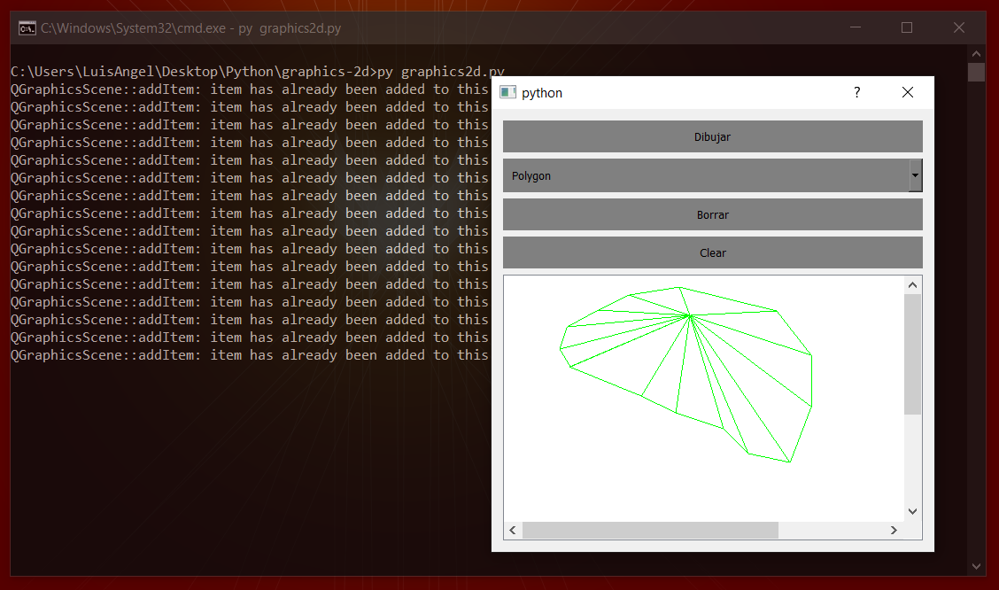

# Graphics 2D
allows us to create graphics with different tools. Specifically we will see how to draw polygons or also known as polylines.

## Procedure
The procedure will be as follows: by clicking and releasing the mouse in a place on the drawing plane we will store that point QPointF (x, y) in a list, the user can add as many points as needed, each point marked on the plane will mark the point of union of each line of the polygon.

## Get Started
> Requirements: Python 3 Installed
1. Install the PyQt5
```
pip3 install PyQt5
```
2. Install the PyQt5 Tools
```
pip3 install PyQt5-tools
```
3. Execute the program:
```
py graphics2d.py
```

## Result of Execution

