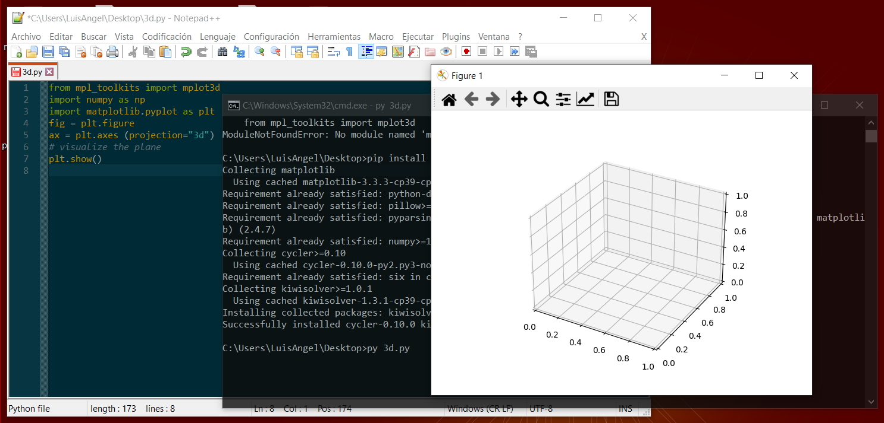
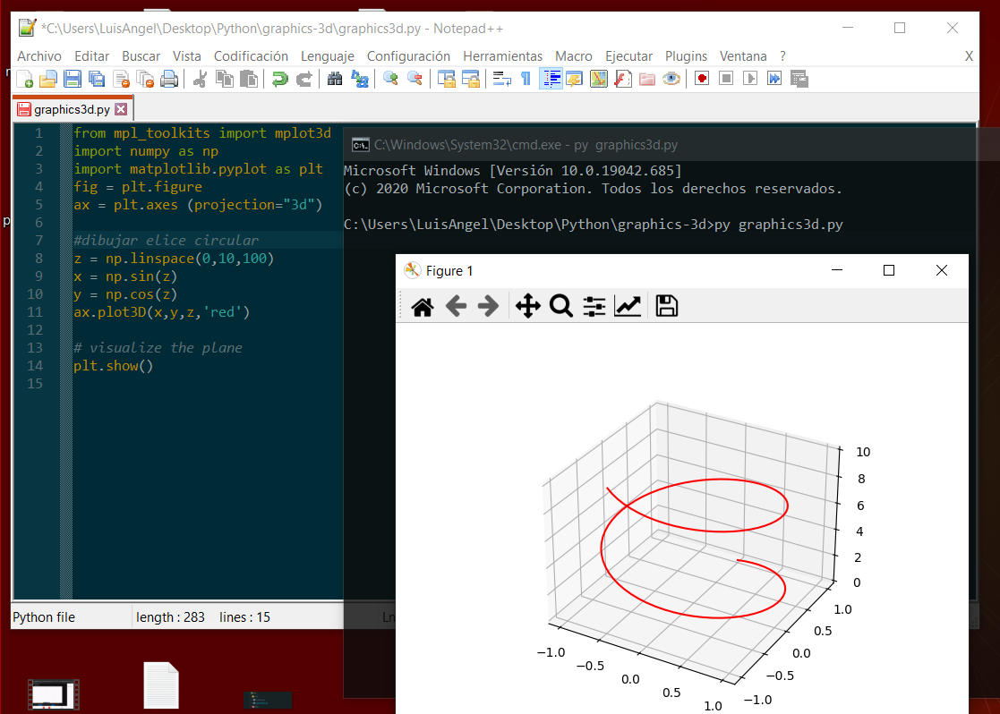
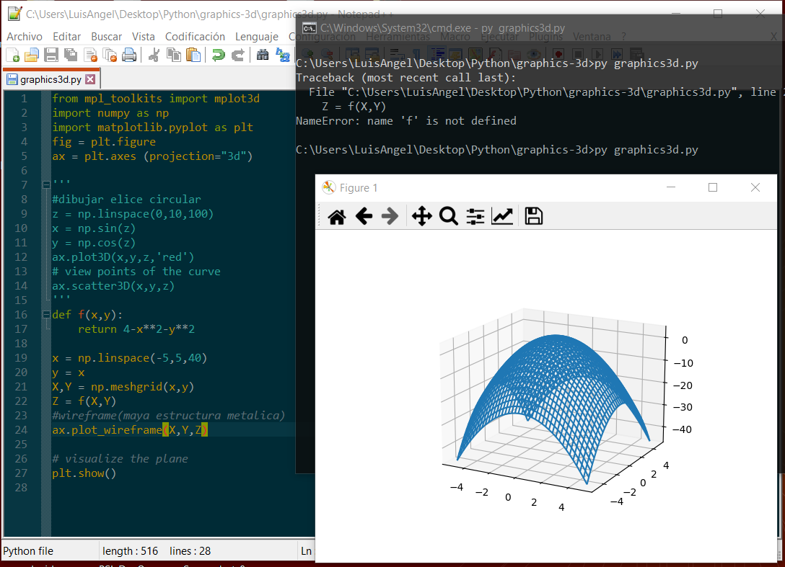
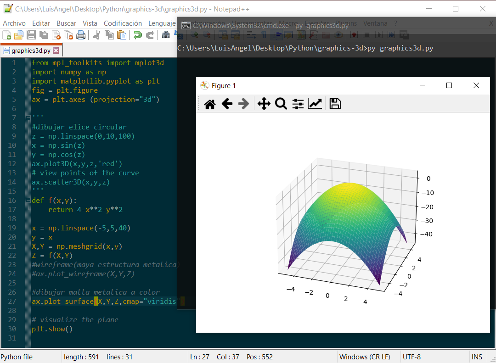

# Graphics  3D


## Procedure


## Get Started
> Requirements: Python 3 Installed
1. Install the matplotlib
```
pip install --upgrade matplotlib
```
2. run the command:
```
pip install -U matplotlib
```
3. Execute the program:
```
py graphics3d.py
```

## Result of Execution

Visualize the plane



Visualize elice circular



Visualize malla en estructura metalica 



Visualize malla en estructura metalica a color




More for graphics: https://www.youtube.com/watch?v=AkhpoE6wqyQ&ab_channel=DavidArmend%C3%A1riz